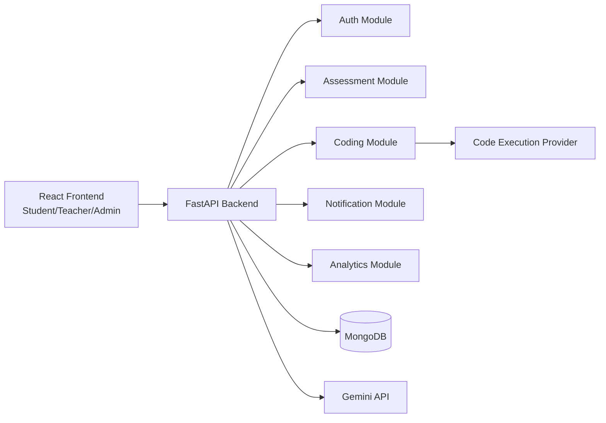
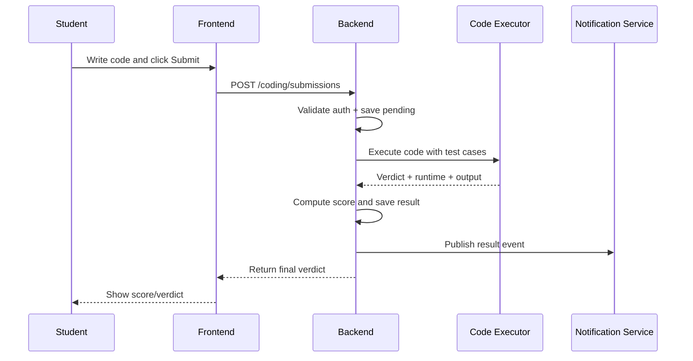
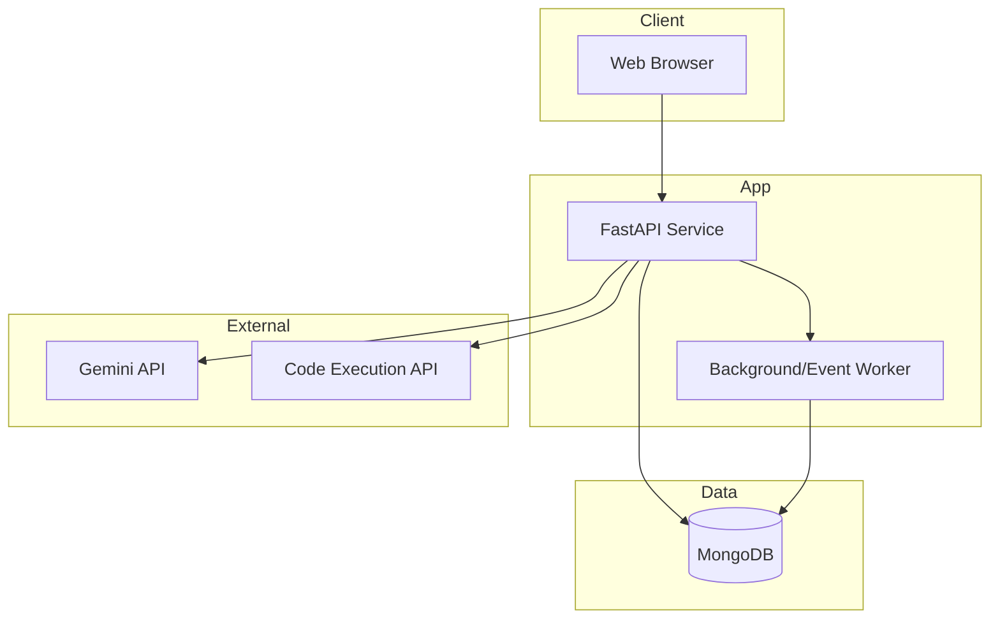

# HACKATHON CONTENT (Saved Version)

## PROBLEM STATEMENT

### Clearly define the problem
Most current learning systems follow a one-size-fits-all model. Students receive the same pace, same style of content, and same type of assessment even when their skill levels are different. As a result, weaker students get left behind and advanced students lose interest.

At the same time, teachers spend a lot of manual effort creating questions, checking submissions, and tracking student performance. This reduces the time they can spend on actual mentoring and concept clarity.

In coding-focused education, the gap is even larger because students need practical, real-time feedback and iterative improvement—not just static theory tests.

### Who faces this problem?
- Students in schools, colleges, and coaching programs
- Teachers and trainers handling large batches
- Institutions trying to improve learning outcomes and placement readiness
- Career-focused programs that need integrated coding + aptitude + concept assessment

### Why is it important or relevant?
- Poor personalization leads to lower confidence and weak learning outcomes
- Manual teaching operations do not scale with larger class sizes
- Institutions need measurable progress and intervention-ready data
- Industry expectations now require problem-solving and coding capability, not only theoretical marks

---

## PROPOSED SOLUTION

### Description of the solution
EDULEARN is an AI-powered adaptive learning and assessment platform that unifies:
- Personalized assessments
- Coding practice and automated code evaluation
- Teacher analytics dashboard
- Notifications and progress tracking

It is designed as one connected system so students, teachers, and institutions can work in a single workflow.

### How it addresses the problem
- Adapts assessments by difficulty, topic, and learner context
- Provides coding execution and automatic evaluation to reduce manual correction effort
- Gives teachers performance insights to identify weak learners early
- Keeps users aligned through reminders, schedules, and notification flows

### What makes it innovative or unique
- Combines theory and coding in one platform
- Focuses on adaptive progression rather than static batch progression
- Reduces teacher administrative load while improving decision-making
- Can show end-to-end value quickly in a hackathon demo

---

## TARGET USERS & IMPACT

### Who will use this solution?
- Students preparing for exams, placements, and coding interviews
- Teachers/trainers in colleges, bootcamps, and coaching centers
- Academic departments and institutions
- Corporate learning and development teams

### What impact does it create?
- Faster and more consistent assessment cycles
- Better learner engagement through personalized pathways
- Clearer visibility into class and individual performance
- Reduced effort in repetitive academic operations
- Improved skill readiness for real-world technical roles

### Scale or potential use cases
- Semester assessments for departments and institutions
- Placement preparation programs (coding + aptitude)
- Online practice and mock test ecosystems
- Continuous internal evaluation for academic programs
- Multi-batch and multi-campus performance benchmarking

---

## FEASIBILITY & APPROACH

### How the team plans to build it in 24 hours
**Phase 1 (Hour 0–3):** Setup and architecture
- Finalize roles, modules, and demo flow
- Configure backend, frontend, and database

**Phase 2 (Hour 3–8):** Core implementation
- Authentication and role-based access
- Assessment creation/attempt flow
- Basic coding execution integration

**Phase 3 (Hour 8–14):** Intelligence and insight
- AI-assisted question/content flow
- Initial analytics and result tracking endpoints

**Phase 4 (Hour 14–20):** Integration and validation
- Connect all modules into one user journey
- Validate submission, scoring, and reporting workflow

**Phase 5 (Hour 20–24):** Demo readiness
- UI polish
- End-to-end scenario testing
- Final deployment and presentation preparation

### Tools / technologies (high-level)
- Frontend: React + TypeScript
- Backend: FastAPI (Python)
- Database: MongoDB
- AI: Gemini API integration
- Code execution: Judge0/HackerEarth-style execution service
- Real-time updates: WebSocket + notifications

### Key features planned for the hackathon
- Authentication + role management (student/teacher/admin)
- Assessment lifecycle (create, assign, attempt, evaluate)
- Coding problem execution with output/test-case checks
- Teacher dashboard with key performance views
- Notification/reminder system for schedules/deadlines
- AI-aided content or recommendation support

---

## COMPETITIVE ADVANTAGE

- End-to-end academic workflow in one platform instead of fragmented tools
- Supports both conceptual learning and hands-on coding assessment
- Provides actionable analytics, not just static marksheets
- Uses AI to accelerate content creation and personalization
- Strong path from hackathon MVP to scalable product

---

## FUTURE SCOPE

### Extensions beyond the hackathon
- Advanced adaptive engine with behavior-based learning paths
- Proctoring and integrity features for high-stakes exams
- Predictive analytics for at-risk students and outcome forecasting
- Mobile-first app and offline learning support
- LMS/ERP integrations for institutional adoption

### Long-term vision
Build EDULEARN into a complete academic intelligence platform that:
- Personalizes learning for every student
- Empowers teachers with AI copilots for assessment and mentoring
- Helps institutions improve retention, outcomes, and placement success
- Bridges the gap between classroom education and industry-ready skills

---

## DETAILED PRODUCT BACKLOG (15 TOPICS)

Below is a detailed, hackathon-ready backlog in the same style as your sample. It includes 15 topics with clear user stories, priorities, acceptance criteria, requirements, and effort estimates.

| ID | Title | Epic | User Story | Priority (MoSCoW) | Status | Acceptance Criteria | Functional Requirements | Non-Functional Requirements | Original Estimate | Actual Effort |
|---|---|---|---|---|---|---|---|---|---|---|
| 1 | User Authentication | Authentication | As a student/teacher/admin, I want to securely register and log in so that my learning data and activities remain protected. | Must | In Progress | Valid signup/login; invalid credentials rejected; logout clears session; password reset works. | Email/password auth, JWT/session handling, forgot/reset password flow, role-based token claims. | Auth response <2s; encrypted password storage; OWASP-compliant validation. | 1 day | 1 day |
| 2 | Role-Based Access Control | User Management | As an admin, I want role-based permissions so that each user sees only authorized modules. | Must | Pending | Students cannot access teacher/admin pages; teachers cannot access admin controls unless allowed. | Route guards, API permission middleware, role mapping matrix. | Unauthorized access blocked 100%; audit logs for restricted attempts. | 1 day | 1 day |
| 3 | Student Profile & Onboarding | User Management | As a student, I want to set my profile and learning goals so that recommendations are more relevant. | Should | Pending | Profile fields save correctly; goals visible in dashboard; onboarding completion tracked. | Profile create/update APIs, onboarding wizard, preferences storage. | Save operation <2s; profile data consistency across sessions. | 0.5 day | 0.5 day |
| 4 | Teacher Dashboard | Dashboard & Analytics | As a teacher, I want a dashboard showing class performance so that I can quickly identify weak areas. | Must | In Progress | Dashboard loads key metrics; filtering by batch/subject works; drill-down is available. | KPI cards, charts, filters, weak-topic insights endpoint. | Dashboard load <3s for normal class size; responsive layout. | 1 day | 1 day |
| 5 | Assessment Creation | Assessment Engine | As a teacher, I want to create quizzes/tests by topic and difficulty so that I can evaluate learning levels. | Must | In Progress | Assessment can be created, edited, and published; question validation enforced. | Create/edit/publish forms, question bank mapping, schedule settings. | Validation error clarity; draft save reliability. | 1 day | 1 day |
| 6 | Assessment Attempt Flow | Assessment Engine | As a student, I want to attempt assigned assessments in a guided interface so that I can complete tests smoothly. | Must | Pending | Timed test starts and auto-submits; answer navigation works; submission confirmation shown. | Attempt UI, timer, autosave, submit endpoint, anti-refresh handling. | No data loss during attempt; autosave every N seconds. | 1 day | 1 day |
| 7 | Coding Problem Module | Coding Platform | As a student, I want to solve coding problems with visible constraints and examples so that I can practice effectively. | Must | In Progress | Problem statement renders correctly; code editor supports language selection; run/submit actions work. | Problem API, code editor integration, language templates, sample test runner. | Editor response <200ms interactions; stable under concurrent usage. | 1 day | 1 day |
| 8 | Code Execution & Evaluation | Coding Platform | As a platform, I want to execute code securely so that submissions can be automatically judged. | Must | Pending | Code runs against test cases; verdict and runtime are returned; failed runs show useful error output. | Sandbox execution integration, hidden/public tests, scoring logic, verdict API. | Execution timeout controls; secure sandbox isolation. | 1.5 days | 1.5 days |
| 9 | Results & Scorecards | Results & Reporting | As a student and teacher, I want instant result summaries so that I can understand performance quickly. | Should | Pending | Score, section-wise breakdown, and pass/fail shown; teacher can view class-level result lists. | Result computation service, result API, scorecard UI. | Result generation <3s post-submission; accuracy >99%. | 0.75 day | 0.75 day |
| 10 | AI Question Generation | AI Features | As a teacher, I want AI-generated questions by topic and level so that assessment preparation is faster. | Could | Pending | Generated questions match topic/difficulty; teacher can edit before publish; unsafe output blocked. | Prompt templates, AI provider integration, moderation filters, regenerate option. | AI response <8s median; content safety checks enforced. | 1 day | 1 day |
| 11 | Adaptive Recommendation Engine | AI Features | As a student, I want next-best practice recommendations so that I can improve weak areas efficiently. | Should | Backlog | Recommendations reflect recent performance; weak-topic suggestions are prioritized. | Recommendation rules/model, performance ingestion, recommendation API. | Recommendation generation <2s; explainable suggestion labels. | 1 day | 1 day |
| 12 | Notifications & Reminders | Communication | As a user, I want reminders for deadlines/live sessions so that I don’t miss important activities. | Should | Backlog | Notifications triggered for upcoming tests; read/unread state tracked; in-app panel updates. | Notification service, scheduler, in-app notification center, optional email hook. | Delivery success >95%; notification fetch <1s. | 0.75 day | 0.75 day |
| 13 | Live Session Support | Collaboration | As a teacher, I want to host live doubt-clearing sessions so that students get real-time support. | Could | Backlog | Live session can be created/joined; attendance captured; session metadata saved. | Live room APIs, join links, attendance tracking, session status management. | Join latency <3s; stable connection under expected load. | 1 day | 1 day |
| 14 | Admin Content Moderation | Admin Panel | As an admin, I want to review and manage content so that platform quality and compliance are maintained. | Should | Backlog | Admin can view, approve, reject, and archive content; action logs are retained. | Admin moderation panel, approval workflow APIs, audit history. | All moderation actions auditable; consistent role enforcement. | 0.75 day | 0.75 day |
| 15 | Audit Logs & Monitoring | Platform Reliability | As an operator, I want system logs and health metrics so that I can detect issues and maintain uptime. | Must | Pending | API health endpoint works; core events logged; errors traceable by request ID. | Structured logging, health checks, metrics capture, error tracking hooks. | 99%+ endpoint availability target; observable latency/error trends. | 0.75 day | 0.75 day |

### Prioritization Strategy (Quick Read)
- **Must (Hackathon Core):** 1, 2, 4, 5, 6, 7, 8, 15
- **Should (High Impact Add-ons):** 3, 9, 11, 12, 14
- **Could (Stretch Goals):** 10, 13

### Suggested 24-Hour Delivery Cut
- Deliver all **Must** topics first for end-to-end demo stability.
- Implement **Should** topics where time permits (especially 9 and 12 for visible value).
- Keep **Could** topics as bonus differentiators for judges.

---

## ARCHITECTURE DOCUMENT

This section provides the architecture choices, justification, and required design artifacts for the EDULEARN hackathon project.

### 1) Application Architecture

#### 1.1 Methodologies considered

1. **Microservices Architecture**
   - Split into independent services (Auth, Assessment, Coding, Notification, Analytics).
   - Pros: independent scaling/deployment, clear service boundaries.
   - Cons: orchestration complexity, service discovery, higher DevOps overhead for a hackathon.

2. **Event-Driven Architecture**
   - Services communicate through events (e.g., `ASSESSMENT_SUBMITTED`, `RESULT_PUBLISHED`).
   - Pros: loose coupling, real-time workflows, extensibility.
   - Cons: event consistency, message tracing complexity.

3. **Serverless Architecture**
   - Functions for specific tasks (AI generation, notification triggers, scheduled jobs).
   - Pros: rapid setup, low infra management, cost-effective for burst traffic.
   - Cons: cold starts, provider lock-in, function-level debugging complexity.

#### 1.2 Selected architecture (Most suitable)

**Selected: Modular Monolith + Event-Driven Internals (Hybrid for hackathon)**

- Use a **single FastAPI deployable application** (faster implementation and easier integration in 24 hours).
- Structure code as **domain modules** (auth, assessments, coding, notifications, analytics).
- Use lightweight **event-driven patterns internally** (publish domain events to async/background handlers).
- Keep boundaries clean so modules can later be extracted into microservices.

#### 1.3 Justification

- Best balance between **speed** and **extensibility**.
- Avoids microservice deployment overhead during hackathon timeline.
- Preserves future migration path to microservices or serverless handlers.
- Supports near real-time use cases (notifications, result updates) through async/event processing.

#### 1.4 Use Case Diagram (textual)

- **Actors**: Student, Teacher, Admin, External Code Executor, AI Provider.
- **Student use cases**: Register/Login, Attempt Assessment, Solve Coding Problem, View Results, Receive Notifications.
- **Teacher use cases**: Create Assessment, Review Results, Monitor Dashboard, Start Live Session.
- **Admin use cases**: Manage Users/Roles, Moderate Content, Monitor Platform Health.
- **External integrations**: Execute code, generate AI-assisted questions.

#### 1.5 Class Diagram (high-level classes)

- `User` (id, role, email, password_hash)
- `StudentProfile` (user_id, goals, batch_ids)
- `TeacherProfile` (user_id, department)
- `Assessment` (id, title, topic, difficulty, questions, schedule)
- `Submission` (id, assessment_id, student_id, answers, score, status)
- `CodingProblem` (id, statement, constraints, test_cases)
- `CodeSubmission` (id, problem_id, student_id, code, language, verdict, runtime)
- `Notification` (id, user_id, type, payload, read_state)
- `ResultReport` (id, user_id, metrics, generated_at)

#### 1.6 DFD (Data Flow Diagram - Level 1)

1. User authenticates via UI → Auth module validates credentials → User session/token issued.
2. Teacher creates assessment → Assessment module stores metadata/questions in DB.
3. Student submits answers/code → Evaluation pipeline computes score/verdict.
4. Results module stores outcomes → Notification module alerts user.
5. Analytics module aggregates data → Dashboard renders insights.

#### 1.7 Component Diagram (logical components)

- **Frontend App (React)**
  - Student Portal, Teacher Portal, Admin Portal
- **Backend API (FastAPI)**
  - Auth Component
  - Assessment Component
  - Coding Component
  - Notification Component
  - Analytics Component
  - Background Task/Event Processor
- **Database (MongoDB)**
- **External Services**
  - AI Provider (Gemini)
  - Code Execution Provider (Judge0/HackerEarth-like)

#### 1.8 Sequence Diagram (sample: coding submission)

1. Student opens coding problem.
2. Frontend sends `POST /coding/submissions` with code.
3. Backend validates auth/role and stores pending submission.
4. Backend calls code execution provider.
5. Provider returns output/verdict/runtime.
6. Backend computes score and persists final result.
7. Notification event is published.
8. Student receives updated verdict/result in UI.

#### 1.9 Deployment Diagram (hackathon)

- **Client Layer**: Browser (Student/Teacher/Admin)
- **Application Layer**: Single FastAPI service (Docker/container or VM)
- **Data Layer**: MongoDB instance (local/Atlas)
- **Integration Layer**: External HTTP APIs (AI + code execution)

Optional scale-out path:
- Add Redis/queue for background jobs.
- Split coding/analytics into separate services post-hackathon.

### 2) Database Architecture

#### 2.1 ER Diagram (textual model)

- `users (1) ---- (0..1) student_profiles`
- `users (1) ---- (0..1) teacher_profiles`
- `teachers (1) ---- (N) assessments`
- `assessments (1) ---- (N) questions`
- `students (N) ---- (N) assessments` via `assessment_assignments`
- `assessments (1) ---- (N) submissions`
- `coding_problems (1) ---- (N) code_submissions`
- `users (1) ---- (N) notifications`
- `users (1) ---- (N) result_reports`

#### 2.2 Schema Design (collection-level)

1. `users`
   - `_id`, `email`, `password_hash`, `role`, `created_at`, `is_active`
2. `student_profiles`
   - `_id`, `user_id`, `goals`, `batch_ids`, `preferences`
3. `teacher_profiles`
   - `_id`, `user_id`, `department`, `subjects`
4. `assessments`
   - `_id`, `title`, `created_by`, `topic`, `difficulty`, `questions[]`, `start_time`, `end_time`, `status`
5. `assessment_assignments`
   - `_id`, `assessment_id`, `student_id`, `assigned_at`, `state`
6. `submissions`
   - `_id`, `assessment_id`, `student_id`, `answers[]`, `score`, `submitted_at`
7. `coding_problems`
   - `_id`, `title`, `statement`, `constraints`, `sample_tests[]`, `hidden_tests[]`
8. `code_submissions`
   - `_id`, `problem_id`, `student_id`, `language`, `source_code`, `verdict`, `runtime_ms`, `submitted_at`
9. `notifications`
   - `_id`, `user_id`, `type`, `message`, `payload`, `is_read`, `created_at`
10. `analytics_snapshots`
   - `_id`, `scope_type`, `scope_id`, `metrics`, `generated_at`

#### 2.3 Indexing and constraints

- Unique index: `users.email`
- Compound index: `submissions (assessment_id, student_id)`
- Compound index: `code_submissions (problem_id, student_id, submitted_at)`
- TTL/cleanup strategy for temporary execution artifacts

### 3) Data Exchange Contract

#### 3.1 Frequency of Data Exchanges

- **Auth APIs**: on login/signup and token refresh.
- **Assessment data**: read frequently during test windows; write on create/submit actions.
- **Code execution**: per run/submit attempt; bursty during contests/live sessions.
- **Notifications**: event-triggered plus periodic polling/websocket pushes.
- **Analytics**: near real-time lightweight counters + scheduled batch aggregation.

#### 3.2 Data Sets Exchanged

1. **Identity Dataset**
   - user_id, role, token claims, session metadata
2. **Assessment Dataset**
   - assessment metadata, questions, options, schedule, assignment status
3. **Submission Dataset**
   - answers/code payload, timestamps, evaluation status, score/verdict
4. **Notification Dataset**
   - notification type, message body, routing target, read state
5. **Analytics Dataset**
   - topic-wise scores, completion rate, weak-area indicators, trend metrics

#### 3.3 Modes of Exchange

- **API (REST/HTTP JSON)**
  - Primary mode for frontend ↔ backend and backend ↔ external integrations.
- **Queue/Event (internal async tasks)**
  - For result processing, notification fan-out, analytics updates.
- **File/Object (optional future)**
  - Bulk import/export (student lists, report archives).
- **WebSocket (real-time)**
  - Live notifications, status updates during assessments/live coding.

### 4) Mermaid Diagram Snippets (ready to paste in markdown tools)

#### 4.1 Component Diagram

#### 4.2 Sequence Diagram (Coding Submission)

#### 4.3 Deployment Diagram

